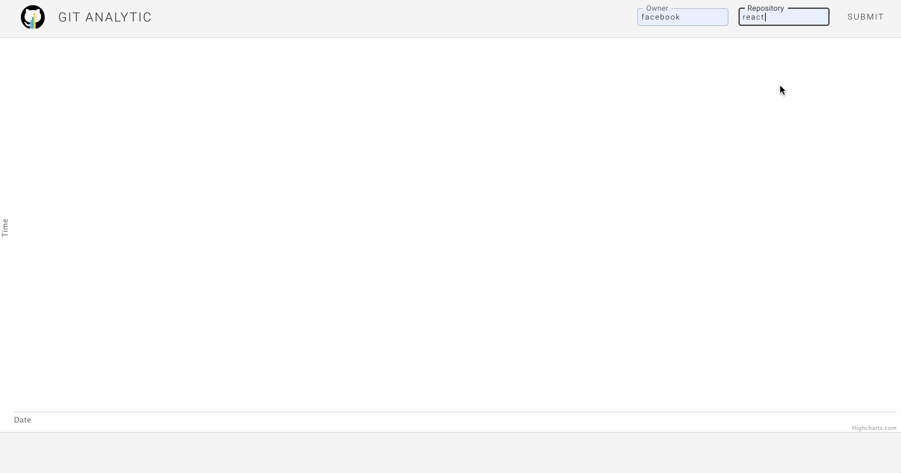

# GIT ANALYTIC
Git Analytic is a single-page web application to visualize data from any public Github repository.



## Getting Started
Clone or fork this repository

```
npm install
npm run dev-start
```
Enter the owner and name of any public Github repository

## Built With
Node, Express, React, Redux, Highcharts, Github API, GraphQL

## Authors
Julianne Crawford
